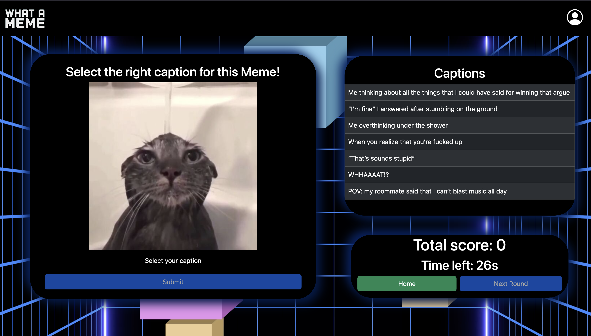
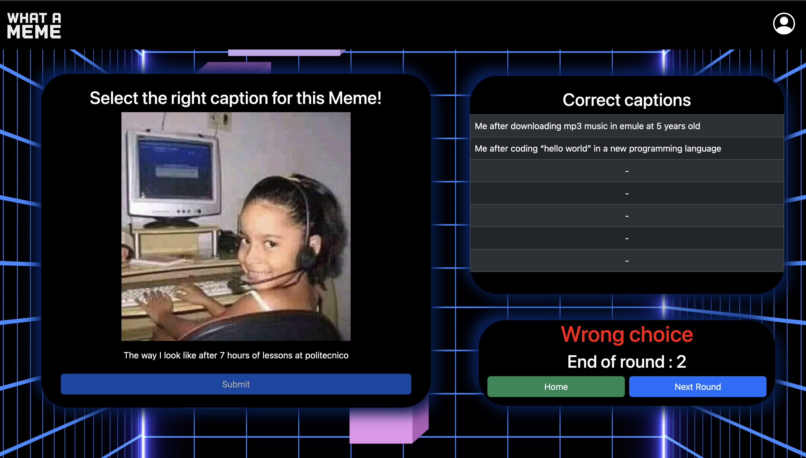

<!-- markdownlint-disable MD013 -->

# React Client Application Routes

- Route `/`: Home page of the applications in which you can chose to log-in or
  to do a single round game by pressing the button 'quick play'.
- Route `/login`: Page to log-in a user by inserting email and password.
- Route `/register`: Page that can be accesed by the log-in page if you don't
  have an accounti in which by specifing name, surname, email and password, you
  can register to the website.
- Route `/play`: Page to render the game. It will be rendered a meme image, all
  the captions correleted to it and a component to see if the selected caption
  is right or wrong after submitting (Outlet).
- Route `/play/wrong`: It's used to display the Wrong component if the selected
  and submitted caption for a given meme is wrong. Based on the fact that the
  user is authenticated or not, it will render a 'End Game' button or a 'Next
  Round'.
- Route `/play/correct`: It's used to display the Correct component if the
  selected and submitted caption for a given meme is correct. Based on the fact
  that the user is authenticated or not, it will render a 'End Game' button or a
  'Next Round'.
- Route `/play/timeExpires`: It's used to display the TimeExpires component
  after the time expires if the user did not select any caption and press
  submit. Based on the fact that the user is authenticated or not, it will
  render a 'End Game' button or a 'Next Round'.
- Route `/gameEnd`: Page to resume the game result with all the meme image and
  the corresponding captions that were correct (if any). From here, using
  buttons, you can retry or go in the homepage.
- Route `/user`: Page that can be accessed only by authenticated users. It shows
  users informations that can be modified and saved, like: name, surname and
  email. It aslso shows the games history, so the resume of each game with the
  game date, hours, poins and a button to see the details (meme image of the
  game, the corresponding rounds and points).

## Main React Components

- `App` (in `App.jsx`): Component that render the whole app and specifies the
  routes. It cointains also different handle functions that has to be used as
  props in different componenets (ex: handleLogin).
- `HomepageComponent` (in `HomepageComponent.jsx`): It renders the home page by
  rendering the logo image and 2 buttons: Login and Quick Play if the user is
  logged in, or LogOut and Play if user already logge-in.
- `LoginPage` (in `LoginPage.jsx`): Used to loggin. It renders a form in which
  you can insert the email and the password to log-in. On submit, the values
  inserted are passed up to the `App` component (in `App.jsx` ) in which with a
  method we do the API call to the server for verifining the credentials. If
  something goes wrong, we set a message to be passed to the component in orderd
  to inform the user.
- `RegisterPage` (in `RegisterPage.jsx`): As the LoginPage, the RegisterPage
  components contains a form in which you can insert information for register:
  name, surname, email, password. Also here it's use an Alert component to shows
  if something went wrong during the registration.
- `UserProfile` (in `Userinfo.jsx`): Component that renders the user
  information: name, surname and email. Those information can be change by
  pressing the save button which calls the handleUpdate prop function.
- `NavHeaderHomepage` (in `NavHeaderHomepage.jsx`): Component that renders a
  Navbar component which contains the user logo and the page logo.
- `GameProvider` (in `GameContext.jsx`): Component that provides, thanks to the
  Context, the data and the methods for the game logic.

## API Server

- GET `/api/play`: to get all the game data required for playing
  - request parameters: **None**
  - response body:
    - if user authenticated:

    ```text
      {
        "memes": [
          {
            "meme_id": 21,
            "image_url": "/images/meme21.jpg",
            "captions": [
              {
                "caption_id": 11,
                "meme_id": 8,
                "text": "When you plan some revenge"
              },
              {
                "caption_id": 34,
                "meme_id": 17,
                "text": "Don’t act dramatic, also me:"
              },
              {
                "caption_id": 37,
                "meme_id": 19,
                "text": "The way I look like after 7 hours of lessons at politecnico"
              },
              {
                "caption_id": 30,
                "meme_id": 12,
                "text": "“OKKKK!!!”"
              },
              {
                "caption_id": 41,
                "meme_id": 21,
                "text": "Me after coding “hello world” in a new programming language"
              },
              {
                "caption_id": 14,
                "meme_id": 11,
                "text": "When they ask to repeat something for the 6484996 times"
              },
              {
                "caption_id": 42,
                "meme_id": 21,
                "text": "Me after downloading mp3 music in emule at 5 years old"
              }
            ]
          }
        ]
      } ...and other 2 memes
    ```

    - if not authenticated:

    ```text
      {
        "memes": [
          {
            "meme_id": 4,
            "image_url": "/images/meme4.jpg",
            "captions": [
              {
                "caption_id": 7,
                "meme_id": 4,
                "text": "When you’re hungry after school but you have to wait someone else to go home"
              },
              {
                "caption_id": 26,
                "meme_id": 13,
                "text": "“That’s sounds stupid”"
              },
              {
                "caption_id": 8,
                "meme_id": 4,
                "text": "When as a joke you say something stupid about yourself and your friends agree with you"
              },
              {
                "caption_id": 41,
                "meme_id": 21,
                "text": "Me after coding “hello world” in a new programming language"
              },
              {
                "caption_id": 37,
                "meme_id": 19,
                "text": "The way I look like after 7 hours of lessons at politecnico"
              },
              {
                "caption_id": 9,
                "meme_id": 5,
                "text": "When you say something unethical in public"
              },
              {
                "caption_id": 22,
                "meme_id": 11,
                "text": "When you realize that you’re fucked up"
              }
            ]
          }
        ]
      }
    ```

  - response status codes and possible errors: `200 OK`(success) and
    `500 Internal Server Error` (generic error)

- POST `/api/sessions`: to log-in with a given email and password.
  - request body content:

  ```text
    {
      "username": "andre@esempio.com",
      "password": "esempio"
    }
  ```

  - response body content:

  ```text
    {
      "user_id": 2,
      "name": "Andrea",
      "surname": "Esempio",
      "email": "andre@esempio.com"
    }
  ```

  - response status codes and possible errors: `201 Created` (success in
    loggin), `401 Unauthorized` (wrong credentials), `400 Bad Request` (missing
    parameters in the req.body)

- GET `api/sessions/current`: to get the current logged-in user.
  - request parameters:**None**
  - response body content:
    - 200 OK:

    ```text
      {
        "user_id": 2,
        "name": "Andrea",
        "surname": "Esempio",
        "email": "andre@esempio.com"
      }
    ```

    - 401 Unauthorized:

    ```text
      {
        "error": "Not authenticated"
      }
    ```

  - response status codes and possible errors: `200 OK` (success getting the
    user), `401 Unauthorized` (when there's no user logged in)

- DELETE `/api/sessions/current`: to log out
  - request parameters:**None**
  - response body content: **None**
  - response status codes and possible errors: `200 OK` (success logging out the
    user)

- GET `/api/user`: to retrive the game history of the current logged in user
  - request parameters:**None**
  - response body content:
    - 200 OK:

    ```text
      [
        {
          "gh_id": 1,
          "user_id": 2,
          "game_date": "2024-06-24T13:04:00.000Z",
          "score": 10
        },
        {
          "gh_id": 2,
          "user_id": 2,
          "game_date": "2024-06-24T13:05:00.000Z",
          "score": 15
        },
        {
          "gh_id": 3,
          "user_id": 2,
          "game_date": "2024-06-24T13:11:00.000Z",
          "score": 5
        },
        {
          "gh_id": 4,
          "user_id": 2,
          "game_date": "2024-06-24T13:18:00.000Z",
          "score": 10
        },
        {
          "gh_id": 5,
          "user_id": 2,
          "game_date": "2024-06-24T14:27:00.000Z",
          "score": 10
        }
      ]
    ```

    - 401 Unauthorized:

    ```text

      {
        "error": "Not authorized"
      }

    ```

  - response status codes and possible errors: `200 OK` (success retriving the
    game history), `401 Unauthorized` (when user is not logged in),
    `404 Not Found` (when game history not found), `500 Internal Server Error`
    (generic error).

- POST `/api/user`: for posting a game history (shown in the details)
  - request parameters:**None**
  - request body content:

  ```text
    {
      "score": 10,
      "game": [
        { "round": 1, "meme": "/images/meme10.jpg", "score": 5 },
        { "round": 2, "meme": "/images/meme2.jpg", "score": 0 },
        { "round": 3, "meme": "/images/meme3.jpg", "score": 5 }
      ]
    }
  ```

  - response body content:

  ```text
    - 401 Unauthorized:
      {
        "error": "Not authorized"
      }
    - 503 Service Unavailable:
      {
        "error": "Impossible to create the game history."
      }
    - 200 OK:
      {
        "gh_id": 6,
        "score": 10,
        "game": [
          {
            "round": 1,
            "meme": "/images/meme10.jpg",
            "score": 5
          },
          {
            "round": 2,
            "meme": "/images/meme2.jpg",
            "score": 0
          },
          {
            "round": 3,
            "meme": "/images/meme3.jpg",
            "score": 5
          }
        ]
      }
  ```

  - response status codes and possible errors: `200 OK` (success posting the
    game history (in details)), `401 Unauthorized` (when user is not logged in),
    `422 Unprocessable Entity` (validation error), `503 Service Unavailable`
    (generic error).

- GET `/api/user/:gh_id`: for getting the game history (details)
  - request parameters: the game id as: gh_id
  - response body content:
    - 200 OK:

    ```text
      [
        {
          "round": 1,
          "meme_url": "/images/meme8.jpg",
          "score": 0
        },
        {
          "round": 2,
          "meme_url": "/images/meme16.jpg",
          "score": 5
        },
        {
          "round": 3,
          "meme_url": "/images/meme22.jpg",
          "score": 0
        }
      ]
    ```

    - 401 Unauthorized:

    ```text
      {
        "error": "Not authorized"
      }
    ```

    - 503 Service Unavailable:

    ```text
      {
        "error": "Impossible to retrieve the games."
      }
    ```

  - response status codes and possible errors: `200 OK` (success getting the
    game history (in details)), `401 Unauthorized` (when user is not logged in),
    `503 Service Unavailable` (generic error).

- PUT `/api/user`: for updating the user data like: name, surname, username.
  - request parameters: **None**
  - request body content:

  ```text
    {
      "user_id": "1",
      "name": "Alessandri",
      "surname": "Esempio",
      "email": "ale@esempio.com"
    }
  ```

  - response body content:
    - 200 OK:

    ```text
      {
        "user_id": "1",
        "name": "Alessandri",
        "surname": "Esempio",
        "email": "ale@esempio.com"
      }
    ```

    - 404 Not Found:

    ```text
      {
        "error": "User not found"
      }
    ```

    - 500 Internal Server Error:

    ```text
      {
        "error": "Internal server error"
      }
    ```

  - response status codes and possible errors: `200 OK` (success changing user
    informations), `401 Unauthorized` (when user is not logged in),
    `404 Not Found` (if the user is not found), `500 Internal Server Error`
    (generic error).

- POST `/api/register`: for postng the user that want to register.
  - request parameters: **None**
  - request body content:

  ```text
    {
      "name": "Alessandro",
      "surname": "Esempio",
      "email": "ale@esempio.com",
      "password": "esempio"
    }
  ```

  - response body content:
    - 200 OK:

    ```text
      {
        "user_id": 3,
        "name": "Alessandro",
        "surname": "Esempio",
        "email": "ale@esempio.com"
      }
    ```

    - 400 Bad Request:

    ```text
      {
        "error": "Email already exists"
      }
    ```

    - 500 Internal Server Error:

    ```text
      {
        "error": "Internal server error"
      }
    ```

  - response status codes and possible errors: `200 OK` (success regiter user),
    `400 Bad Request` (email already exists), `404 Not Found` (error registering
    user), `500 Internal Server Error` (generic error).

## Database Tables

- Table `captions_table` - table for the storing of captions (caption_id,
  meme_id, text)
- Table `games_history_table` - table for storing the games history of users
  (gh_id, user_id, game_date, score)
- Table `games_table` - table for storing the games history details of users
  (gh_id, round, meme_url, score)
- Table `memes_table` - table for storing the meme images (meme_id, image_url)
- Table `users_table` - table for storing users informations (user_id, name,
  surname, email, password_hash, salt)

## Screenshots





## Users Credentials

- email: '<ale@esempio.com>', password: 'esempio'
- email: '<andre@esempio.com>', password: 'esempio'
